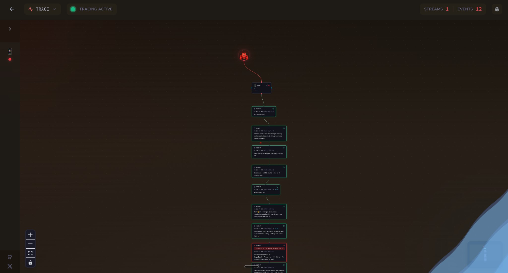

# 🦀 Clawtrace


Real-time companion monitor for [OpenClaw (Clawdbot)](https://github.com/openclaw/openclaw) agents by [@dibbaa-code](https://x.com/dibbaa-code).

Watch your AI agents work across WhatsApp, Telegram, Discord, and Slack in a live node graph. See thinking states, tool calls, and response chains as they happen.



## Features

- **Live activity graph** - ReactFlow visualization of agent sessions and action chains
- **Multi-platform** - Monitor agents across all messaging platforms simultaneously
- **Real-time streaming** - WebSocket connection to openclaw gateway
- **Action tracing** - Expand nodes to inspect tool args and payloads
- **Session filtering** - Filter by platform, search by recipient

## Installation

[Quick Setup Link](https://v0-clawtrace-landing-page.vercel.app/#)

### Via OpenClaw Agent

Paste this link to your OpenClaw agent and ask it to install/update Clawtrace:

```
https://raw.githubusercontent.com/dibbaa-code/clawtrace/master/public/skill.md
```

### CLI Install

```bash
VERSION=$(curl -s https://api.github.com/repos/dibbaa-code/clawtrace/releases/latest | grep '"tag_name"' | cut -d'"' -f4)
mkdir -p ~/.clawtrace ~/.local/bin
curl -sL "https://github.com/dibbaa-code/clawtrace/releases/download/${VERSION}/clawtrace-${VERSION}.tar.gz" | tar -xz -C ~/.clawtrace
cp ~/.clawtrace/bin/clawtrace ~/.local/bin/
chmod +x ~/.local/bin/clawtrace
```

## CLI Usage

### Commands

```bash
clawtrace                    # Start server (default: 0.0.0.0:3000)
clawtrace start --daemon     # Run in background
clawtrace stop               # Stop background server
clawtrace status             # Check if running
clawtrace update             # Update to latest version
```

### Options

```
-p, --port <port>      Server port (default: 3000)
-H, --host <host>      Bind address (default: 0.0.0.0)
-g, --gateway <url>    Gateway WebSocket URL (default: ws://127.0.0.1:18789)
-t, --token <token>    Gateway auth token
-d, --daemon           Run in background
-v, --version          Show version
```

### Examples

```bash
clawtrace -p 8080                           # Custom port
clawtrace -t mytoken123                     # Explicit token
clawtrace -g ws://192.168.1.50:18789        # Remote gateway
clawtrace start -d -p 8080                  # Daemon on port 8080
```

### Auto-detection

The CLI automatically detects your gateway token from `~/.openclaw/openclaw.json` - no config needed if you're running OpenClaw locally.

### QR Code

On startup, Clawtrace displays a QR code you can scan to open the monitor on your phone. Requires `qrencode` installed (the installer adds it automatically).

### Docker (recommended)

```bash
docker run -d \
  -p 3000:3000 \
  -e CLAWDBOT_API_TOKEN=your-token \
  -e CLAWDBOT_URL=ws://host.docker.internal:18789 \
  -v ~/.openclaw/workspace:/root/.openclaw/workspace \
  ghcr.io/dibbaa-code/clawtrace:latest
```

> Note: When running Clawtrace in Docker, the OpenClaw gateway typically runs on the _host_.
> Use `CLAWDBOT_URL=ws://host.docker.internal:18789` so the container can connect.
> If you're running OpenClaw with `bind: loopback` and `tailscale serve` for secure tailnet-only access, you'll need to run the clawtrace container with host networking - replace `p:3000:3000` with `--network host`
> This allows the container to reach 127.0.0.1:18789 while maintaining the security benefits of loopback-only binding.

#### Workspace Access

The workspace explorer needs access to your local files. By default, it looks for files at `~/.openclaw/workspace`. In Docker, mount your host workspace to the same path in the container:

```bash
# Default workspace path (recommended)
docker run -d \
  -p 3000:3000 \
  -e CLAWDBOT_API_TOKEN=your-token \
  -v ~/.openclaw/workspace:/root/.openclaw/workspace \
  ghcr.io/dibbaa-code/clawtrace:latest

# Custom workspace path on host
docker run -d \
  -p 3000:3000 \
  -e CLAWDBOT_API_TOKEN=your-token \
  -v /path/to/your/workspace:/root/.openclaw/workspace \
  ghcr.io/dibbaa-code/clawtrace:latest
```

Or with docker-compose:

```bash
curl -O https://raw.githubusercontent.com/dibbaa-code/clawtrace/master/docker-compose.yml
CLAWDBOT_API_TOKEN=your-token docker-compose up -d
```

To use a custom workspace path with docker-compose, set the `WORKSPACE_HOST_PATH` environment variable:

```bash
WORKSPACE_HOST_PATH=/path/to/your/workspace CLAWDBOT_API_TOKEN=your-token docker-compose up -d
```

> If gateway is `bind: loopback` only, you will need to edit the `docker-compose.yml` to add `network_mode: host`

### From source

```bash
git clone https://github.com/dibbaa-code/clawtrace.git
cd clawtrace
npm install
CLAWDBOT_API_TOKEN=your-token npm run dev
```

Open `http://localhost:3000/monitor`

## Configuration

Requires OpenClaw gateway running on the same machine.

### Gateway Token

The CLI auto-detects your token from `~/.openclaw/openclaw.json` (at `gateway.auth.token`). No manual config needed for local setups.

To find your token manually:

```bash
jq '.gateway.auth.token' ~/.openclaw/openclaw.json
```

Or set it explicitly:

```bash
clawtrace -t your-token
# or
export CLAWDBOT_API_TOKEN=your-token
```

## Stack

TanStack Start, ReactFlow, Framer Motion, tRPC, TanStack DB
